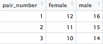
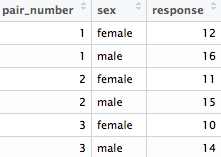
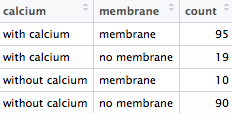

```{r setup, include = FALSE}
# This line is used for getting the output from R to not have the leading "##" and for specifying the default size of figures.  Lastly, tidy will try to make sure the code doesn't step outside the margins.
knitr::opts_chunk$set(comment = "", fig.width = 7, fig.height = 3)
# These two lines allow for more columns to be printed by default for data frames
options(dplyr.width = Inf)
options(width = 70)
# These lines adds a box around any R output
hook_output <- function(x, options) {
  paste0('\\begin{Verbatim}[frame=single]\n', x, '\\end{Verbatim}\n')
}
knitr::knit_hooks$set(output = hook_output)
# These lines change R warnings & messages to be boxed and red
hook_warning <- function(x, options) {
  paste0('\\begin{Verbatim}[frame=single, formatcom=\\color{red}]\n', x, '\\end{Verbatim}\n\n')
}
knitr::knit_hooks$set(message = hook_warning, warning = hook_warning)
```

# Downloading R, RStudio, and LaTeX

If you would like to put RStudio on your personal Mac, a tutorial on installing R, RStudio, and the required \LaTeX\ packages is available on Reed's [Data@Reed](data@reed.edu) [page](http://www.reed.edu/data-at-reed/software/R/r_studio.html).  If you have a Windows computer, you can download R [here](https://cran.r-project.org/bin/windows/base/), RStudio [here](https://www.rstudio.com/products/rstudio/download/), and \LaTeX\ [here](http://miktex.org/download).

After downloading and installing R, RStudio, and \LaTeX, please make sure to run through step 9 of the [Data@Reed](data@reed.edu) resources [page](http://www.reed.edu/data-at-reed/software/R/r_studio.html#TestInstall) to ensure you can use R from both the Console (the lower leftmost pane in RStudio by default) and also to create an R Markdown document (the upper leftmost pane in RStudio by default).  After installing \LaTeX\ and attempting to Knit your first document in these steps, you may be prompted in RStudio to install a few extra \LaTeX\ packages.

<!--
Convert to RStudio Server?
-->

# Installing and loading R packages

First, you need to make sure that the required R packages are installed in order to perform your analyses.  Packages are a way of extending the features in the base R language.  These packages are useful ways of developing specific algorithms to improve the implementation of solving a variety of problems.  We begin by ensuring the needed packages for your analysis are downloaded:

```{r install_packages, message = FALSE}
pkg <- c("dplyr", "ggplot2", "readr", "tidyr", "equivalence")
new.pkg <- pkg[!(pkg %in% installed.packages())]
if (length(new.pkg)) {
  install.packages(new.pkg, repos = "https://cran.rstudio.com")
}
```

Note the use of the `c()` function here.  This is the way R combines arguments into a vector.  You can think of `c` as standing for "combine" or "concatenate".  Above we have created a vector called `pkg` that contains the two elements:  `"dplyr"` and `"ggplot2"`.  These are two packages we will use for data manipulation and data visualization.

The next line of code below the `pkg` declaration checks to see if any of the packages listed in `pkg` are not in the set of installed packages that are loaded into R by default.  The last bit of code in this chunk checks to see if the length of this new variable `new.pkg` is nonzero.  If it is, it installs the packages listed in `new.pkg`.  We are starting out with some difficult R code, but really this is just a way to ensure that packages aren't downloaded over and over again.

To load these packages into your R environment, we use the `library()` function:

```{r load_packages, message = FALSE}
library(ggplot2)
library(dplyr)
library(readr)
library(tidyr)
```

_Helpful Note_:  If you try to use any functions that are in external packages like `dplyr` without making sure you first have the package installed and that you have the package loaded, you will receive an error regarding an object not being found.  Go back and make sure you've included the appropriate code to load the package into your environment.  

It's also important to understand that R and R Markdown progress much like a book so code may depend on previous code.  If you are getting errors like `Error: object 'x' not found`, it may be because you didn't load in prior R code into your analysis that defined these variables.

\nonumsection{Producing Documents using the Knit Feature}

You may be used to thinking of statistical packages and word processing as needing to occur in two different programs (Word and JMP, for example).  R Markdown produces a way to have both your commentary (what used to go into Word) and your statistical analysis (what used to go into JMP) in the same document.  After creating a new R Markdown document in RStudio via File -> New File -> R Markdown, you will see a `Knit` button near the top of the leftmost window.  If you click on the down arrow next to the `Knit`, you will see the option to `Knit to PDF`, `Knit to PDF`, and `Knit to Word`.  You should try each of these with the default R Markdown template file that is loaded in for you.  The great thing about using Markdown is that it can be easily converted into a variety of different formats.  In fact, this document was also created using R Markdown!

# Data Entry and Manipulation

There are a variety of ways to enter data into R.  You will first see how to directly enter data instead of reading in from an external file.  To begin, make sure that RStudio is open by clicking on the blue circle with a white R on the inside of it in the application dock on the Mac (or similar operations on PC/Linux machines).

You can enter the values into vectors like you saw above and then combine those vectors into a data frame.  Data frames are one of the most useful ways to organize your data in R.  Try to be descriptive (and consistent!) in your naming of variables.  One good practice is to use underscores between words in your variable names.  

You also need to make sure to not have spaces in your names and understand that case matters with variable names.  Therefore, `Length` is different than `length`.

```{r variable_declares}
day_of_lab <- c("Tuesday", "Wednesday", "Friday", 
                "Tuesday", "Wednesday", "Friday")
location <- c(rep("pond", 3), rep("lake", 3))
height <- c(3, 5, 5.84, 9.68, 10.61, 10.63)
water_df <- data_frame(day_of_lab, location, height)
```

The chunk above has created four variables: 

- `day_of_lab` which is a vector containing six entries on the day the lab was conducted
- `location` which is a vector specifying where the measurements were taken (Notice the use of the `rep()` function here which saves you from entering `c("pond", "pond", "pond", "lake", "lake", "lake")` by repeating "pond" three times and "lake" three times.)
- `height` which is a vector containing (as one may suspect) measurements of body height in millimeters
- `water_df` which is a data frame that combines the three vectors as columns
  
You can get an idea of what a variable looks like by choosing to "print" it.  Notice here that the default row names (the leftmost column when printed) are set to just be the row number.

```{r}
print(water_df)
```

You can also look at the contents of an R variable by just entering the name of the variable.  This implicitly calls the `print()` function.

```{r}
water_df
```

Another useful function is the `str` function which shows the structure of a data frame.  Remember that `Variables` correspond to columns and `Observations` correspond to rows in the data frame.

```{r}
str(water_df)
```

As you may have guessed, `day_of_lab` and `location` are of the character class (`chr`) and `height` in `water_df` is stored in the numerical class.

\nonumsection{Adding Rows}

Suppose that you made an error and you actually forgot to add the last row of entries to your `water_df` data frame.  You can use the `rbind()` function which will bind the row to the end of the data frame you specify.

```{r}
new_row <- list(day_of_lab = "Monday", location = "lake", 
                height = 8.23)
new_df <- rbind(water_df, new_row)
new_df
```

If you switch the order in which you specify the arguments to the `rbind()` function, you can insert the new row at the top of the data frame.

```{r}
second_df <- rbind(new_row, water_df)
second_df
```

You can also select multiple rows in a couple different ways.

  - Select the second row
  
    ```{r}
    second_row <- slice(new_df, 2)
    second_row
    ```

  - Select first and third rows
  
    ```{r}
    first_third_rows <- slice(new_df, c(1,3))
    first_third_rows 
    ```

  - Select second, third, and fourth rows

    ```{r}
    second_to_fourth_rows <- slice(new_df, 2:4)
    second_to_fourth_rows
    ```

  - Select first, fourth, fifth, sixth, and seventh rows    
    ```{r}
    neg_row_select <- slice(new_df, -c(2, 3))
    neg_row_select
    ```

You may be the most surprised by the last selection.  You can use the "negative index" to select everything but the rows specified.  Think about how we might use this and the `rbind()` function to insert a row in the middle of a data frame:

```{r}
first_two <- slice(water_df, 1:2)
remaining <- slice(water_df, -(1:2))
third_df <- rbind(first_two, new_row, remaining)
third_df
```

_Important note_:  Adding rows is this way can sometimes be more difficult than just updating your initial declarations and adding the values into your variables there.  One of the great things about R Markdown is all of your analysis will be updated when you re-run your analysis by Knitting the file together so it's often better to just update your initial variable declarations.

\nonumsection{Adding Columns}

Columns are easier to work with in R by making use of the `select` and `mutate` functions.  Columns are also more likely to correspond to named variables and we can, thus, select based on those names.

I'll first add the column to an existing data frame and then you can reorganize the column to fall in a different location as you wish.  Below you can see that I've created a new vector called `new_col` that stores the body weights of the individuals measured in grams.  I've then used the `mutate` function on my data frame called `new_df` to add a new column there called `weight` and set it equal to `new_col`.

```{r}
new_col <- c(10.27, 15.23, 20.88, 40.19, 42.54, 41.36, 35.64)
fourth_df <- mutate(new_df, weight = new_col)
fourth_df
```

If you'd prefer this newly added column to be in a different location in your data frame, you can use the `select()` function.  Suppose you wanted `weight` to appear directly after `day_of_lab`:

```{r}
fifth_df <- select(fourth_df, 
                   day_of_lab, weight, location:height)
fifth_df
```

There is a simpler way to handle these last two operations and it uses piping, which is discussed in the next section.

\nonumsection{Piping versus non-piping}

One of the nice features of the `dplyr` package in R is its ability to use piping as a way of chaining functions together.  This improves readability of your code and removes the need to ensure parentheses match up and keeps arguments to functions close to the actual function call. Pipes take the output from one function and feed it into the next function.  Some examples may help.

Instead of defining the `fourth_df` and `fifth_df` data frames, we can eliminate the intermediate creation of `fourth_df` by using piping:

```{r}
fifth_df <- new_df %>%
  mutate(weight = new_col) %>%
  select(day_of_lab, weight, location:height)
fifth_df
```

The pipe `%>%` can be interpreted as "then."  Here you can see that `mutate(new_df, weight = new_col)` is the same as `new_df %>% mutate(weight = new_col)`.  In other words, when you use the pipe symbol it can be interpreted as passing whatever is on the left of the `%>%` symbol as the first argument into the function called after the `%>%` symbol.  We can then use this chaining to pass what was essentially the `fourth_df` variable into the `select` function and then reorder to get `weight` in the appropriate spot.  You will see many more examples of this chaining throughout the rest of this manual.

\nonumsection{Formula}

It may be the case that you'd like to create a new column that is based on other columns via a formula.  You can use the `mutate` function again to do just that.  Suppose we want to perform a calculation similar to BMI for the individuals in `new_df` and create the corresponding variable called `bmi` in the `fifth_df` data frame:

```{r}
fifth_df <- fifth_df %>% mutate(bmi = weight / height)
fifth_df
```

You can do more advanced calculations as well and create multiple columns at once:

```{r}
fifth_df <- fifth_df %>%
  mutate(calc_1 = sqrt(weight) + 1.8 * sin(bmi),
         calc_2 = height / 2 - calc_1)
fifth_df
```

\nonumsection{Hide and Exclude Rows or Columns from Analysis}

If you'd prefer to exclude certain rows of data, you can use the `filter()` function to specify your conditions.  Suppose you want to only include rows that have `height` of less than or equal to six:

```{r}
excluded_df <- new_df %>% filter(height <= 6)
excluded_df
```

You can use the `select()` function and `-` to remove columns from your analysis.  (Notice that it's often a good habit to create a new variable like `excluded_df` so that you don't overwrite your original data.)

```{r}
removed_calc_2 <- fifth_df %>% select(-calc_2)
removed_calc_2
```

\nonumsection{Selecting a Random Subset of Data}

Suppose that you wanted to select at random a subset of data to test.  You can use the `sample_n()` function to achieve this.  Let's select two rows at random from `new_df`:

```{r}
random_rows <- new_df %>% sample_n(2)
random_rows
```

# Frequency Distributions

A _frequency distribution_ is the most fundamental picture of your data set. It consists of the number of individuals having particular values of the trait being measured. 

__Reading in from a file__

In order to see an example of building a histogram that represents a frequency distribution, we will read data in from a CSV file. It's often easier to enter data into a CSV file and then read that into R instead of entering all of the values manually as you saw previously. This data set contains 278 entries corresponding to a measurement of length measured in millimeters.  

It's also a good habit to put all of your data files into a folder called `data` in the same folder/directory as where your Rmd file is stored/saved.  You can then use the `read_csv` from the `readr` package to load data stored in a CSV file into a data frame:

```{r}
length_data <- read_csv("data/freq_dist_data.csv")
str(length_data)
```

You will next see an example of how to use the `ggplot2` package to plot in R.  Notice the use of the piping operator here which passes `length_data` in as the first argument to the `ggplot` function:

```{r, message=FALSE}
length_data %>% ggplot(aes(x = standard_length)) +
  geom_histogram()
```

Note that `ggplot` uses the `+` symbol to __add__ layers to the plot.  This is similar to the piping symbol and it's easy to get them switched.  
By default, `ggplot` specifies a `binwidth` of $range / 30$, where $range$ corresponds to the largest value in the data set minus the smallest values in the data set.  It also uses black fill as the default choice.  We can tweak the `binwidth`, `fill` color, and outline `colour` by specifying those arguments inside the `geom_histogram` function:

```{r}
length_data %>% ggplot(aes(x = standard_length)) +
  geom_histogram(binwidth = 2.5, fill = "darkseagreen", 
                 colour = "black")
```

_Helpful Note_: A listing of all the built-in colors by name is available [here](http://www.stat.columbia.edu/~tzheng/files/Rcolor.pdf). 

In order to test hypotheses, we need to describe frequency distributions by calculating several statistics. This can be accomplished quite easily using the `summarize` function in the `dplyr` package:

```{r}
summary_stats <- length_data %>%
  summarize(mean = mean(standard_length),
            std_dev = sd(standard_length),
            N = n(),
            std_err = std_dev / sqrt(N),
            lower_CI_limit = mean + qt(0.025, df = N - 1) * std_err,
            upper_CI_limit = mean + qt(0.975, df = N - 1) * std_err)
summary_stats
```

As you can see, six calculations have been made here:

- `mean`: the mean of the `standard_length` variable
- `std_dev`: the standard deviation of the `standard_length` variable
- `N`: the number of observations in the `standard_length` variable
- `std_err`: the standard error of the mean of the `standard_length` variable
- `lower_CI_limit`: the lower bound of a 95% confidence interval for the corresponding population mean of the `standard_length` variable
- `upper_CI_limit`: the upper bound of a 95% confidence interval for the corresponding population mean of the `standard_length` variable

\medskip

__Overlaying a normal distribution__

After you have calculated these summary statistics, you can also use these `mean` and `std_dev` variables as inputs into the mean and standard deviation of a normal distribution.  You can then plot this normal distribution over the top of your frequency distribution to provide a visual as to how well the data could be represented by a normal curve. The function related to this curve is the __normal density curve__ which is denoted as `dnorm` in R:

```{r}
length_data %>% ggplot(aes(x = standard_length)) +
  geom_histogram(aes(y = ..density..), binwidth = 2.5, 
                 fill = "darkseagreen", 
                 colour = "black") +
  stat_function(fun = dnorm, 
                args = list(mean = summary_stats$mean,
                            sd = summary_stats$std_dev),
                colour = "red")
```

Note here the addition of the `aes(y = ..density..)` parameter which puts the normal curve and the histogram on the same scale.  Density corresponds to the percentage of values that fall in a given bin which is just the transformation of `count / N`.

\nonumsection{Producing counts of subsets}

The `summarize` function you saw earlier can also be used to produce summaries of subsets of data by using the `group_by` function. A larger collection of data similar to that seen with the height measurements at a lake/pond on different days of the week is used to show an example of this.  We begin by reading the data into a data frame:

```{r}
water_full <- read_csv("data/water_data.csv")
```

Next we will calculate the mean and standard deviation of `body_height` for both levels of `location`:

```{r}
location_summaries <- water_full %>% group_by(location) %>%
  summarize(mean = mean(body_height),
            std_dev = sd(body_height))
location_summaries
```

We can further group by `location` and `day_of_lab` to get a summary for all combinations of those two variables.  Notice how similar this code is to the chunk immediately above:

```{r}
location_day_summaries <- water_full %>% 
  group_by(day_of_lab, location) %>%
  summarize(mean = mean(body_height),
            std_dev = sd(body_height))
location_day_summaries
```

# Probability ($P$) Values and the Null Hypothesis

Statistical tests are devised to test a __null hypothesis__ of no statistically significant effect of X (treatments) on Y (measured response variable). They result in a probability (p-value) that these results could exist by chance. 

If the probability is low enough (p < 0.05), we can reject the null hypothesis and support the alternate hypothesis that X is statistically significantly affecting Y.

Write this inside the cover of your lab notebook to refer to when you do a statistical test:

__If p is greater than (>) 0.05, then you can't reject the null hypothesis.__

__If p is less than (<) 0.05, then you can reject the null hypothesis.__

Another way to think about this is:

> If p > 0.05, there is no statistically significant effect of X on Y.

You never \underline{accept} the null hypothesis. You can only \underline{fail to reject} the null hypothesis.

If p < 0.05, there is a statistically significant effect of X on Y. 

You never \underline{prove} the hypothesis. 

You can only \underline{support} the alternate hypothesis by rejecting the null hypothesis.

At this point, your job is to describe the \underline{direction} (positive or negative, < or >) of the significant effect.

Depending on the type of test, this could be stated as:

> As X increases, Y statistically significantly \underline{increases} (or decreases).

or

> X Group A has a statistically significantly \underline{greater} mean Y than X Group B.


Remember that statistical significance and biological relevance are not the same.

See page G-2-3 for more information.

# Reporting on Statistical Results

Scientific writing is very efficient. 

One super-informative sentence can summarize the same information as six sentences.

1. The mean standard length for stickleback fish in the pond (38.9 mm) was statistically significantly greater than in the lake (35.9 mm) (ANOVA, F = 12.6, df = 1, 452, p = 0.0004). 

instead of

> 1. The null hypothesis is that the mean Y values for treatments A and B 
were not statistically significantly different. 

> 2. We can reject the null hypothesis, as the p-value was less than 0.05. 

> 3. There is a statistically significant difference. 

> 4. The difference is that the mean for A is greater than for B. 

> 5. The mean for A was #, while the mean for B was #.

> 6. The ANOVA results were that F = #, the df = #, # and the p = #. 

Using the phrase "statistically significantly" implies that the null hypothesis was rejected based on the p-value being less than 0.05. 

Your lab notebook is an appropriate place to write out the six sentences 
to keep track of the logic. 

In a lab report, the null hypothesis being tested should be mentioned near the end of the Materials and Methods section, and the single summary sentence should be used in the Results section.

# Analysis of Variance (ANOVA)

## Univariate, single factor, one-way ANOVA {-}

An appropriate data set for this type of analysis includes one column containing nominal `chr` data that represents the different (more than 2) treatments and one column containing continuous `int` or `dbl` data that represent the measured responses to the treatments.  An example is below:

```{r}
day_of_lab <- c(rep("Tuesday", 5), rep("Wednesday", 5), 
                rep("Thursday", 5))
standard_length <- c(38.4, 46.2, 32.2, 35.7, 39.4, 
                     28, 31.8, 35, 29.3, 30.1,
                     33.33, 33.23, 35.2, 35.99, 30.81)
anova_data <- data_frame(day_of_lab, standard_length)
anova_data
```

The `aov()` function fits an Analysis of Variance model with at least one predictor variable and a response variable.  Here the response is `standard_length` and the predictor is `day_of_lab`.  In other words, we are looking to see if there is statistical evidence that at least one difference exists in mean `standard_length` for Tuesday, Wednesday, and Thursday.  The variable `length_model` is defined to store the resulting values obtained by the ANOVA fit.  The `anova()` function is then used on `length_model` to produce the corresponding Analysis of Variance table.

```{r}
length_model <-  aov(standard_length ~ day_of_lab, data = anova_data)
anova(length_model)
```

Here, `F value` is the value of the F statistic associated with the __ANOVA__.  `Pr (>F)` is the __p-value__.

A visual representation of this analysis can be achieved by first calculating summary statistics as before.  Here, the columns for count and standard deviation are omitted.

```{r}
day_summaries <- anova_data %>% 
  group_by(day_of_lab) %>%
  summarize(mean = mean(standard_length),
            std_dev = sd(standard_length),
            N = n(),
            std_err = std_dev / sqrt(N),
            lower_CI_limit = mean + qt(0.025, df = N-1) * std_err,
            upper_CI_limit = mean + qt(0.975, df = N-1) * std_err) %>%
  dplyr::select(-N, -std_dev)
day_summaries
```

Before plotting, the data frame is sorted to follow the more natural weekly progression instead of alphabetical order.

```{r}
reorder <- c("Tuesday", "Wednesday", "Thursday")
day_summaries %>% 
  mutate(day_of_lab = ordered(day_of_lab, levels = reorder)) %>%
  ggplot(aes(x = day_of_lab, y = mean)) +
  geom_errorbar(aes(ymin = lower_CI_limit, ymax = upper_CI_limit), 
                width = 0.1) +
  geom_point(colour = "red") +
  xlab("Day of Lab") +
  ylab("Standard Length (mm)")
```

- The error bars around the means are the 95% confidence intervals (95% CI).

- When reporting statistical test results in text, state the result and then the supporting test details in parentheses.

Summary statement:

The mean stickleback standard length was statistically significantly greater on Tuesday (38.4 mm) than on Wednesday (30.8 mm) (ANOVA, F = 8.3, df = 1,8, P = 0.02).

- Note that there are two degrees of freedom (df) reported: Model DF and Error DF from the Analysis of Variance table.
 
- The Model DF is based on the number of categories in your X factor -1. 
In the above example, there are 2 days of lab -1 = 1 df.

- The Error DF is based on the Total DF - the Model DF. 
In the above example, Total DF is 9 - 1 = 8 df.

-	Sample size N = Total DF + 1.

See pages I-5-7 for an explanation of ANOVA.

# Post-hoc Tests

An appropriate data set for this type of analysis includes one column containing nominal `chr` data that represents the different (more than 2) treatments and one column containing continuous `int` or `dbl` data that represent the measured responses to the treatments.

- If you cannot reject your null hypothesis (ANOVA p>0.05), then your analysis is complete. 

- If you can reject your null hypothesis (ANOVA p<0.05), and there are three or more groups that are being compared, you might want to ask which groups are statistically significantly different from each other and which are not statistically significantly different. In order to do this, we have to compute __a posteriori__ (after the fact) __p-values__. These are called __post-hoc tests__. There are many ways to do this, but we will suggest a conservative method here known as Tukey's Honest Significant Difference.  `TukeyHSD` expects an `aov` fitted model as its parameter as we have with `length_model`. 

```{r}
TukeyHSD(length_model)
```

In this one-way __ANOVA__, there are 3 levels or groups: Tuesday, Wednesday and Thursday. An ANOVA had already told us that the null hypothesis could be rejected (p=0.02).  Now we are asking if Tuesday's mean is statistically significantly different than Thursday's mean, and the answer at the p < 0.05 level is: no, it is not. The p-value for that comparison is 0.1387. Is Tuesday's mean statistically significantly different from Wednesday's mean? Yes, it is. The p-value for that comparison is 0.01509. Is Thursday's mean statistically significantly different from Wednesday's mean? No, it is not.  The p-value for that comparison is 0.4366.

Summary statement:

> Tuesday's mean standard length (38.4 mm) is statistically significantly greater than Wednesday's mean (30.8 mm), and Thursday's mean (33.7 mm) is not statistically significantly different from either of the other groups' means (ANOVA, F = 5.7, df = 2,12, p = 0.02, Tukey post-hoc HSD).

Using a different post-hoc test such as __Pairwise t test__ will give similar results.  See page I-7 for more explanation.

# Bivariate Linear Regression Analysis

An appropriate data set for this type of analysis includes two columns containing continuous `int` or `dbl` data that are associated with each other row by row. An example looking at the relationship between body height and standard length follows.  First, the data is loaded in.

```{r}
std_length <- c(22, 23.8, 25.1, 26.9, 27, 
                27.1, 28.7, 29.7, 30.9, 31.5, 
                32.6, 33.8, 34.1, 35.2, 36.2)
height <- c(5.17, 6.3, 8.5, 7.7, 6.19, 
            7.21, 6.63, 8.54, 8.6, 7.7, 
            7.8, 9.79, 8.64, 8.8, 8.77)
reg_example <- data_frame(std_length, height)
```

Now, a model is fit using the `lm` function which stands for "linear model".  Note the order in which the variables are inputted before and after the "tilde".

```{r}
reg_model <- lm(height ~ std_length, data = reg_example)
```

We can get a multitude of information about this fit by using the `anova()` and `summary()` functions on `reg_model`:

```{r}
anova(reg_model)
summary(reg_model)
```

- The equation for the straight line $\hat{Y} = b + mX$ corresponding to the fit is taken from the `Coefficients:` table:

$$ \hat{Body \text{ } Height \text{ } (mm)} = 1.18455 + 0.22171 * [Standard \text{ } Length \text{ } (mm)] $$

- `F value` is the F statistic associated with __ANOVA__. 

- `Pr (>F)` is the corresponding __p-value__.

-	When reporting statistical test results in text, state the result and then the supporting test details in parentheses.

Summary statement:

> There is a statistically significant positive relationship between standard length and body height in stickleback fish (ANOVA, F = 18.5, df = 1,13, p = 0.0008). 

-	Note that there are two degrees of freedom (df) reported. The first is the Model DF and the second is the Error DF from the Analysis of Variance table (`Residuals`).

-	Sample size N= Total DF + 1.

-	__Multiple R-squared__ varies from 0 (no fit) to 1 (perfect fit of all points to the line).

See page I-8 for more explanation.

A plot showing the relationship between the two variables follows.  Also on the plot is the best-fit line through your data points and the 95% confidence intervals for the true slope.

```{r}
reg_example %>% ggplot(aes(x = std_length, y = height)) +
  geom_point() +
  geom_smooth(method = lm, se = TRUE)
```

# ANCOVA

An appropriate data set includes one column containing nominal `chr` data that represents the different (more than 2) treatments and two columns containing continuous `int` or `dbl` data that represent the measured responses to the treatments.

```{r}
ancova_example <- read_csv("data/ANCOVA.csv")
```

Here, `Body Height (mm)` will be Y variable status (also called response variable, dependent variable, and is the variable you actually measured.)  There are two explanatory X variables:  the continuous `Standard Length (mm)` and the nominal `Location`.  Finally, and most importantly, to finish adding the X factors, you must allow for an __interaction__ term. This essentially tests whether the effects of any X variable on Y is dependent on other X variables in the model. Notice the full interaction model in the code below.

```{r}
ancova_model <- aov(Body_Height_mm ~ Standard_Length_mm + Location 
                    + Standard_Length_mm:Location, 
                    data = ancova_example)
anova(ancova_model)
```

Notice the p-values (`Pr(>F)`) for each of the terms you are testing in the Analysis of Variance Table.

Summary statements:

> There is a statistically significant positive relationship between standard length and body height (ANCOVA, F = 27.1180, df = 1,6, P = 0.002). 

> There is no statistically significant difference between lake and pond in the height of the regression lines for standard length vs. body height (ANCOVA, F = 0.0179, df = 1,6, P = 0.89796).

> There is a statistically significantly steeper slope for lake than pond for the relationship between standard length and body height (ANCOVA, F = 7.4184, df = 1,6 , P = 0.03447). 

- There are two degrees of freedom (df) reported. The first is the DF for each effect in the Analysis of Variance table, and the second is the Error DF from the Analysis of Variance table (`Residuals`). 

- Sample size N= Total DF + 1.

See page I-9 for more explanation.

A plot showing the relationship between `Standard_Length_mm` and `Body_Height_mm` as well as the best-fit line through your data points for both `lake` and `pond` values follows.  Notice that the points are colored corresponding to which `Location` they were measured.

```{r}
ancova_example %>% ggplot(aes(x = Standard_Length_mm, 
                              y = Body_Height_mm, 
                              colour = Location)) +
  geom_point() +
  geom_smooth(method = lm, se = FALSE)
```

# Two-Way ANOVA

An appropriate data set for this type of analysis includes two columns containing nominal `chr` data that represents the different (more than 2) treatments and one column containing continuous `int` or `dbl` data that represent the measured responses to the treatments.  An example is below:


```{r}
two_way_anova_example <- read_csv("data/two_way_ANOVA.csv")
```

Here, `Standard Length (mm)` will be Y variable status (also called response variable, dependent variable, and is the variable you actually measured.)  There are two explanatory X variables:  the nominal `Day of Lab` and the nominal `Location`.  Finally, and most importantly, to finish adding the X factors, you must allow for an __interaction__ term. This essentially tests whether the effects of any X variable on Y is dependent on other X variables in the model. Notice the full interaction model in the code below.  (Note that you can only specify the interaction using `*` and it will by default add back in the non-interaction terms.)

```{r}
two_way_model <- aov(Standard_Length_mm ~ Day_of_Lab * Location,
                    data = two_way_anova_example)
anova(two_way_model)
```

Notice the p-values (`Pr(>F)`) for each of the terms you are testing in the Analysis of Variance Table.  A further breakdown of means, standard errors, and confidence intervals for different groupings is below.

```{r}
location_summaries <- two_way_anova_example %>% 
  group_by(Location) %>%
  summarize(mean = mean(Standard_Length_mm),
            std_dev = sd(Standard_Length_mm),
            N = n(),
            std_err = std_dev / sqrt(N)) %>%
  dplyr::select(-N, -std_dev)
location_summaries
```

```{r}
day_lab_summaries <- two_way_anova_example %>% 
  group_by(Day_of_Lab) %>%
  summarize(mean = mean(Standard_Length_mm),
            std_dev = sd(Standard_Length_mm),
            N = n(),
            std_err = std_dev / sqrt(N),
            lower_CI_limit = mean + qt(0.025, df = N-1) * std_err,
            upper_CI_limit = mean + qt(0.975, df = N-1) * std_err) %>%
  dplyr::select(-N, -std_dev)
day_lab_summaries
```

```{r}
day_loc_summaries <- two_way_anova_example %>% 
  group_by(Day_of_Lab, Location) %>%
  summarize(mean = mean(Standard_Length_mm),
            std_dev = sd(Standard_Length_mm),
            N = n(),
            std_err = std_dev / sqrt(N),
            lower_CI_limit = mean + qt(0.025, df = N-1) * std_err,
            upper_CI_limit = mean + qt(0.975, df = N-1) * std_err) %>%
  dplyr::select(-N, -std_dev)
day_loc_summaries
```

Lastly, for tests with P<0.05 and three or more groups, you can examine Tukey's Honest Significant Difference.  The `$` and code following it here corresponds to focusing on the interaction terms (the only variable with more than two groups).

```{r}
TukeyHSD(two_way_model)$`Day_of_Lab:Location`
```

Summary statements:

> The mean stickleback standard length was statistically significantly larger in the lake (58.6 mm) than the pond (28.6 mm) (Two way ANOVA, F = 58.7, df = 1,36, p < 0.0001). 

> The mean stickleback standard length was statistically significantly larger on Tuesday (48.6 mm) than on Wednesday (38.6 mm)  (Two way ANOVA, F = 6.5, df = 1,36, p = 0.02).

> There is a statistically significant interaction effect in that in the lake, the mean standard length for Tuesday (68.1 mm) was statistically significantly larger than for Wednesday (49.1 mm), but in the pond, the Tuesday (29.1 mm) and Wednesday (28.1 mm) means were not statistically significantly different (Two way ANOVA, F = 5.3, df = 1, 36, p = 0.02771, Tukey post-hoc HSD). 

- There are two degrees of freedom (df) reported. The first is the DF for each effect in the Effect Tests table, and the second is the Error DF from the Analysis of Variance table (`Residuals`). 

-	Sample size N= Total DF + 1.

-	See the next discussion for the appropriate graph showing the means and 95% CI for each of the subgroups.

See page H-20 for post-hoc test interpretation.

See page I-10 for more explanation.

\newpage

To visualize the summaries given above, we can make plots that include error bars.  We can plot the same data with different order of X Categories.

```{r fig.height=2.7, message = FALSE}
dodge <- position_dodge(width = 0.1)
day_loc_summaries %>% 
  ggplot(aes(x = Day_of_Lab, y = mean, colour = Location)) +
  geom_errorbar(aes(ymin = lower_CI_limit, ymax = upper_CI_limit), 
                width = 0.1, position = dodge) +
  geom_point(position = dodge) +
  xlab("Day of Lab") + ylab("Mean Standard Length (mm)")
```


```{r fig.height=2.7, message = FALSE}
day_loc_summaries %>% 
  ggplot(aes(x = Location, y = mean, colour = Day_of_Lab)) +
  geom_errorbar(aes(ymin = lower_CI_limit, ymax = upper_CI_limit), 
                width = 0.1, position = dodge) +
  geom_point(position = dodge) +
  xlab("Location") + ylab("Mean Standard Length (mm)")
```

# How to Make an Overlay Plot

This shows how to plot more than one line on a set of axes.  An appropriate data set for this type of analysis includes at least two columns containing continuous `int` or `dbl` data that are associated with each other row by row, and a column containing nominal `chr` data that represent the different treatments.

First, the data is loaded in:

```{r}
overlay <- read_csv("data/overlay_data.csv")
str(overlay)
```

Then, a plot is made:

```{r}
overlay %>% 
  ggplot(aes(x = Irradiance, y = PS_Rate, colour = species)) +
  geom_point(aes(shape = species)) +
  geom_line()
```

# How to Fit a Curve to a Y by X Graph

An appropriate data set for this type of analysis includes two columns containing continuous `int` or `dbl` data that are associated with each other row by row.  For a relationship that is not linear, it does not make sense to turn on the best-fit straight line or the 95% confidence intervals for the slope.  Many types of curves can be fit through bivariate data points. The `geom_smooth` function will be used here with `method = loess`, where "loess" is an abbreviation for "local polynomial regression fitting."

```{r}
X <- c(1116.4, 870, 630, 470, 239, 118, 0)
Y <- c(4.17, 4.04, 3.67, 3.22, 1.78, 0.78, -0.49)
curve_data <- data_frame(X, Y)
```

```{r}
curve_data %>% ggplot(aes(x = X, y = Y)) +
  geom_point() +
  geom_smooth(method = "loess", se = FALSE)
```

The `loess` method uses a default sensitivity `span` value of 0.75.  You can tweak this value as you see fit to control the degree of smoothing.  A few examples are below.

```{r}
curve_data %>% ggplot(aes(x = X, y = Y)) +
  geom_point() +
  geom_smooth(method = "loess", se = FALSE, span = 1000)
```

```{r, fig.height=3.5}
curve_data %>% ggplot(aes(x = X, y = Y)) +
  geom_point() +
  geom_smooth(method = "loess", se = FALSE, span = 0.6)
```

You can also add reference lines to plots by using the `geom_hline` and `geom_vline` functions.  These vertical lines may be useful to find the X value where the fit curve crosses the X-axis or to find the X value where the fit curve levels off.  

```{r, fig.height=3.5}
curve_data %>% ggplot(aes(x = X, y = Y)) +
  geom_point() +
  geom_smooth(method = "loess", se = FALSE, colour = "red") +
  geom_hline(yintercept = 0) +
  geom_vline(xintercept = 900, colour = "blue") +
  geom_vline(xintercept = 50, colour = "blue")
```

# Testing the Difference Between **Two** Means (unpaired data)

An appropriate data set for this type of analysis contains at least one column that designates the experimental condition as a nominal `chr` variable X and one column that contains the Y response variable as continuous `int` or `dbl` data.

First, the data is loaded:

```{r}
unpaired_data <- read_csv("data/unpaired.csv")
```

Next a `t.test` is performed.  Note that the __t test__ only works when comparing the mean  measurements of exactly two groups and assuming the variances of the two population groups are equal.  (There is a separate __t test__ option that assumes unequal variances.)

```{r}
t.test(bp ~ drug, data = unpaired_data, var.equal = TRUE)
```

- Here, the `p-value`  is the same as the ANOVA `Pr(>F)` p-value given below. The __ANOVA__ model is the extension of the equal variance __t test__.

```{r}
anova(aov(bp ~ drug, data = unpaired_data))
```

It's often appropriate to compare the distributions of response values for the two groups.  This is most frequently done by comparing boxplots as below:

```{r}
unpaired_data %>% ggplot(aes(x = drug, y = bp)) +
  geom_boxplot()
```

See page I-11 for more explanation.

# Testing the Difference Between **Two** Means (paired data)

- Data are considered paired if they are dependent in some way. This could be a male and female in a pair, or the same individual tested over time or under different conditions as in before and after taking a drug.

- There are two formats with which paired data often is stored.  You can convert the second format into the first as you will see later.

### FORMAT 1 {-}



- Here the data includes __two__ columns containing the two measures of the continuous variable such that paired data for each are on a single row.  Again, the `t.test` function is used but this time we specify `paired = TRUE`.  (It is set to `FALSE` by default.)

```{r}
pair_number <- c(1:10)
female <- c(12, 11, 10, 9, 8, 7, 6, 5, 4, 3)
male <- c(16, 15, 14, 13, 10, 9, 8, 6, 5, 3)
matched_df <- data_frame(pair_number, female, male)
t.test(matched_df$female, matched_df$male, paired = TRUE)
```

- The `p-value` here is for the paired t-test with the null hypothesis that there is no significant difference between the means of the two populations.

- If you use the `paired = TRUE` option, `t.test` expects the data to be stored as vectors and that's why the `$` syntax is used as opposed to the usual `formula` syntax.

- Next a plot of the difference of the two responses is on the y-axis, and the mean of the two responses on the x-axis.  Additionally, lines have been added for the lower and upper bounds of a 95% confidence interval for the population mean difference as well as the sample mean difference, which are calculated in the `summary_matched` variable.

```{r}
matched_1 <- matched_df %>%
  mutate(difference = male - female,
         avg = (male + female) / 2)
str(matched_1)
```

```{r}
summary_matched <- matched_1 %>%
  summarize(mean = mean(difference),
            std_dev = sd(difference),
            N = n(),
            std_err = std_dev / sqrt(N),
            lower_CI_limit = mean + qt(0.025, df = N-1) * std_err,
            upper_CI_limit = mean + qt(0.975, df = N-1) * std_err) 
```


```{r}
matched_1 %>% ggplot(aes(x = avg, y = difference)) +
  geom_point() +
  geom_hline(yintercept = summary_matched$lower_CI_limit, 
             linetype = "dashed", colour = "red") +
  geom_hline(yintercept = summary_matched$upper_CI_limit, 
             linetype = "dashed", colour = "red") + 
  geom_hline(yintercept = summary_matched$mean, 
             colour = "red")
```

### FORMAT 2 {-}



- Here the data includes __one__ column containing the continuous variable that you have measured as the response variable (`response` above), a second column that designates the experimental condition as a nominal column (`sex` above), and a third column that designates how the data are paired (`pair number` above). 

You can use the `spread` function in the `tidyr` package to transform data of this form into the format seen in __FORMAT 1__:

```{r warning = FALSE}
matched_2 <- read_csv("data/matched2.csv")
matched_spread <- matched_2 %>% spread(key = sex, value = response)
str(matched_spread)
```

The same results as before are given since the data sets (`matched_spread` and `matched_df`) now match:

```{r}
t.test(matched_spread$female, matched_spread$male, paired = TRUE)
```

A useful plot can be created that connects members of pairs by their response values if data is of the __FORMAT 2__ variety.  If you'd like to transfer data in __FORMAT 1__ into __FORMAT 2__, you can use the `gather` function which is essentially the opposite of the `spread` function.

```{r}
matched_gather <- matched_spread %>%
  gather(key = sex, value = response, -pair_number)
matched_gather
matched_gather %>% ggplot(aes(x = sex, y = response, 
                              colour = factor(pair_number))) +
  geom_point() +
  geom_line(aes(group = pair_number))
```

The addition of `factor()` here is done so that the pair numbers are treated as categories and not as a continuous variable to better differentiate the colors.  Without the `factor` addition, the colors will correspond to different shadings of the default color blue with 10 corresponding to darkest and 1 corresponding to lightest.

Summary information can also be provided via the following:

```{r}
matched_gather %>% 
  group_by(sex) %>%
  summarize(mean = mean(response),
            std_dev = sd(response),
            N = n(),
            std_err = std_dev / sqrt(N),
            lower_CI_limit = mean + qt(0.025, df = N-1) * std_err,
            upper_CI_limit = mean + qt(0.975, df = N-1) * std_err) 
```

- This format and test can be expanded to more than two groups (ex: response of each individual to 3 different drugs) for a __repeated measures ANOVA__.

# Equivalence Test

An appropriate data set for this type of analysis contains at least one column that designates the experimental condition as a nominal `chr` variable X and one column that contains the Y response variable as continuous `int` or `dbl` data.

- You want to confirm that there is no significant difference in mean Y response variable for the different X experimental conditions, but it is impossible to prove this.

- Instead, you need to pick a threshold of difference for which any smaller differences are considered to be irrelevant. This threshold can be set based on the limits of technical resolution or practical importance. 

- The __Equivalence Test__ in R uses two __*t*-tests__ to determine if the difference between the two means of interest is significantly different from the allowed threshold of difference, denoted by `epsilon` ($\varepsilon$).  


```{r, message=FALSE}
equivalence::tost(matched_spread$male, matched_spread$female, 
                  epsilon = 6)
```

See page I-12 for more explanation.

# Chi-Square Contingency Table Analysis

## For raw data that need to be tallied {-}

An appropriate data set for this type of analysis contains at least two columns containing nominal `chr` variables.  

```{r}
nom_data <- read_csv("data/contingency.csv")
str(nom_data)
```

To visualize this data we can do the following:

```{r}
colors = c(blue = "blue", red = "red", green = "forestgreen")
nom_data %>% ggplot(aes(x = sex, fill = color)) + 
  geom_bar(position = "fill") +
  scale_fill_manual(values = colors) + 
  ylab("portion")
```

You want to examine the distribution of a nominal response variable (`color` above) that you measured as predicted by the values of a nominal (`sex` above) that you have imposed or occurred naturally. Note that both Y and X may contain >2 categories. 

First, you'll need to tally the data and you can use the `table()` function to do so:

```{r}
contin_table <- table(nom_data)
contin_table
```

The observed total for each cell is tallied from the data table and appears in the upper right hand corner of each cell on the contingency table (always integers).
You then pass this `table` object, which is essentially just a 2 x 3 matrix containing the count values, into the `chisq.test` function:

```{r}
chi_square_test <- chisq.test(contin_table)
chi_square_test
```

The `p-value` here is used to decide if the null hypothesis can be rejected.

The $\chi^2$ test here produces a warning highlighted in red.  To better understand this warning, it's useful to look at the expected cell counts.  There are BIAS RULES which are assumptions that need to be checked in order for the chi-square test to be unbiased:

1. No expected frequency should be less than 1.0.

2. No more than 20% of the expected frequencies should be less than 5.0.

If your data violate the above bias rules, then the Chi-Square that you calculate will be biased and may increase the probability of rejecting $H_0$ when it is actually true.

```{r}
chi_square_test$expected
```

You may also be interested in the column and row margin totals for your contingency table.  These can be added by wrapping the table in the `addmargins` function.	The row totals (far right) and column totals (bottom row), as well as the grand total (lower right cell) are given.  These totals are used to calculate, for each cell, the value expected if the null hypothesis is true. The expected values are displayed above.

```{r}
addmargins(contin_table)
```

_Important note_:  Make sure not to run the `chisq.test` procedure on a table that include margin totals since it will add those into the analysis.

Another way to view the contingency table instead of by counts as `table` provides is by using `prop.table()` function which expects a `table` as input:

```{r}
prop.table(contin_table)
```

See page I-13 for more explanation.

## For Tallied Results {-}

An appropriate data set includes two nominal (`chr`) columns for the two types of categories and a third with continuous (`int`) data showing the total number of times each combination occurred.

- For the counts, never use percentages as sample size is then lost.

- Always use frequencies (the number of times something happened).



```{r}
tallied <- read_csv("data/tallied.csv")
tallied
```

The `xtabs` functions turns this data frame into a contingency table.  The frequency goes to the left of the `~` and the two nominal variables go to the right of the `~` and are separated by a `+`.  Lastly, we include the `data` argument.

```{r}
contin_table2 <- xtabs(count ~ calcium + membrane, data = tallied)
chisq.test(contin_table2)
```

See page I-13 for more explanation.

# Chi-Square Goodness of Fit Analysis

An appropriately formatted data set includes one nominal column containing categorical data such as male or female, heads or tails for a coin toss, or A or a phenotype.  You want to examine the distribution of a nominal response variable Y that you measured as predicted by the values of a theoretical model. 

```{r}
Phenotype <- c("A", "A", "a", "A", "A", "A", "A",
               "a", "A", "a", "A", "A", "A", "a",
               "A", "A", "A", "a", "A", "a")
phen_cont <- table(Phenotype)
```

To visualize this data we can do the following:

```{r}
data_frame(Phenotype) %>% ggplot(aes(x = Phenotype)) + 
  geom_bar(position = "dodge", fill = "darkseagreen",
           colour = "black")
```

Next you enter the Hypothesized Probabilities `p`, such as 0.75 and 0.25 for a predicted Mendelian 3:1 ratio of A to a phenotypes from a Aa X Aa cross. Notice the order here matters so we designate 0.25 first and then 0.75 since `a` came before `A` in our table.

```{r}
chisq.test(phen_cont, p = c(0.25, 0.75))
```

The `p-value` here is used to decide if the null hypothesis can be rejected.

Summary statement:

> The observed phenotypic ratio was not significantly different from the expected ratio of 3:1 for a one-gene, two-allele, simple dominance Mendelian model (Chi-Square, X^2^ = 0.27, df = 1, p = 0.61).

See page I-13 for more explanation. 
