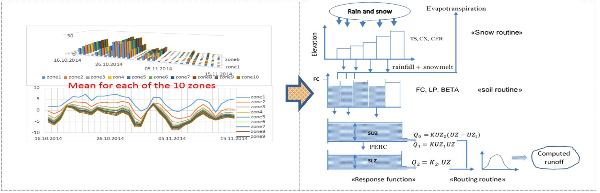
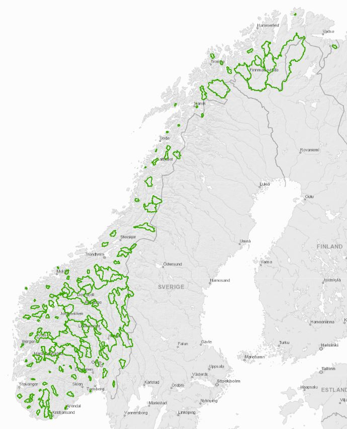

```{r setup, include=FALSE}
knitr::opts_chunk$set(echo = TRUE)
```


# What is it?
### The model

The HBV model is among the classical, conceptual hydrological precipitation – runoff models. It was developed far back in the seventies (Bergstrøm, 1976), designed for a reasonable demand of computer capacities, as was available at that time. The original model has undergone numerous revisions and improvements, and today there are several implementations of HBV available. In the present application, the “Nordic” HBV model (Killingveit and Sælthun, 1995; Sælthun, 1996) is used. For a detailed review of the model, please refer to these publications. A brief introduction to the model is given below. See figure 1 for an illustration.

The model can be classified as a semi-distributed conceptual model. It uses the subbasin as the primary hydrological unit, and within this, an area-elevation distribution and a crude classification of land use is implemented. All processes contribute directly to runoff at the outlet without internal routing between elevation zones or along the river reaches. The model consists of subroutines for 
-	snow accumulation and melt 
-	soil moisture accounting
-	dynamic part: runoff generation

***The snow routine*** controls snow accumulation and melt, and works separately for each elevation and vegetation zone. Additional snow over a given accumulated storage is distributed according to a lognormal pattern, specified by two parameters. The division of rain from snow and melting from non-melting is controlled by threshold temperatures. Snow melt is estimated by a simple degree-day expression. The water holding capacity of snow has to be exceeded before any runoff is generated. During cold periods, the content of free water in the snow is reduced under the operation of a refreezing coefficient. All the subdivisions of the snow distribution in an altitude zone is treated individually, ensuring a fragmented snow pattern by the end of the winter season. In the present model version, snow on glaciers accumulates and melts at the same rate as snow on non-glacierized areas in the same altitude level.

An essential part of the HBV model is the ***soil moisture accounting routine***. Rain and meltwater from snow and glaciers is separated into input to the soil moisture zone and percolation to the dynamical part of the model. The share of the input retained in the soil moisture zone is controlled by the water content in this zone. In addition, water can be drawn up to the zone from the ground water zones. Actual evapotranspiration is calculated based on the water content in this zone. Once captured in the zone, water is only removed by evapotranspiration.

Runoff is generated in the ***upper and lower zones*** of the model. The excess percolation water from the soil moisture zone is transformed to runoff for the catchment as a whole, by piecewise linear reservoirs with three outlets. The upper level represents the rapid storm flow, whereas the lower one provides for the long-term base flow of the basin. The momentary response is integrated over the time step. As long as there is water in the upper zone, a constant deep percolation feeds the lower zone.

As a conceptual model, the HBV model has only a minor physical resemblance to the natural processes in the associated catchment. Some physiographical parameters, like catchment area, hypsographic curve etc. can be quantified from GIS data, but the majority of the parameters must be calibrated, i.e. they are adjusted so that model simulated runoff, given a defined input data set, is as similar as possible to the observed runoff. The HBV model is calibrated for the 145 flood forecasting model catchments.

*Figure 1: the structure of the HBV model to the right. Input data for 10 altitude zones is illustrated to the left.* 

### Input data

Input data to the model are precipitation and temperature, derived from interpolated grids, covering Norway with a spatial resolution of of 1 x 1 km2 and a temporal resolution of 24 hours, the seNorge grid (ref.).These observation grids are available from 1957 up to present, and similar forecast grids cover the period nine days ahead. The observation grids are made by spatial interpolation of all available point observations of precipitation and temperature, respectively. For the forecast period, the grids are made by applying the precipitation and temperature grids from the operational NWP models and downscale to 1 x 1 km2. Data for each altitude zone are read separately from the grid, and applied directly for each zone, without any altitude correction.

### References

Bergström, S. 1976. Development and application of a conceptual runoff model for Scandinavian catchments. SMHI Report RH07. 

Killingveit, Å. and N. R. Sælthun. 1995. Hydrological models. In Hydropower Development 7: Hydrology. Trondheim: Norwegian Institute of Technology, pp. 99-128.

Sælthun, N.S. 1996. The Nordic HBV Model. NVE Publication no. 07, 26 pp.

seNorge-referanse

# Where do we use it?

145 catchments spread over the country, representing most catchment scales and geographical regions of Norway and 33% of the land surface, are selected as model catchments for the flood forecasting service. For these catchments, hydrological forecasts are made by all the hydrological models applied in the flood forecasting system. Besides the requirement of representativeness, the 145 catchments are selected with an aim to use catchments with a long, high-quality and non-regulated data series, supply flood forecasts for the flood prone river reaches where flood zone maps are developed, and to have a good meteorological station coverage. Figure 2 shows a map where the 145 catchments are highlighted. The map includes two catchments, Numedalslågen at Kongsberg and Mjøsa at the outlet, where regression models have been developed on the basis of HBV catchment models within or close to the catchments.

*Figure 2: The flood forecasting model catchments* 

# How to run it?

The hydrological model forecasts make up a central part of the flood forecaster’s decision support tool. The models are integrated processing units in this system. Updated meteorological data, i.e. observations and weather forecasts, are transferred from the meteorological office several times a day, and updated hydrological forecasts are made. Table 1 shows the present scheme of the daily hydrological model operation.

*Table 1: Operational scheme for the hydrological models* 

Post proce3ssing: Two different versions of HBV are run operationally at NVE.

## HBV_UM: uncertainty model

HBV with uncertainty model: /hdata/drift/flom/usikkerhet_grd/utskrift/vfpost_usikkerhet.txt 

Output of the uncertainty model: median result based on a distribution of meteo input data
A few quantiles (take 10%, 90%), also based on the distribution of meteo data

## HBV_P: +/- 50% precipitation

HBV with + 50% precipitation: /hdata/drift/flom/usikkerhet_grd/ut_test/vfpost_usikkerhet.txt
 * Pure model run (not processed): this is in the dataset but it is the same as in 1., so shouldn't be plotted!
 * Updated: automated update using observed streamflow (different method)
 * Results from a run with precip + 50%

# How is it used by the visualization app

## HBV_UM

## HBV_P


