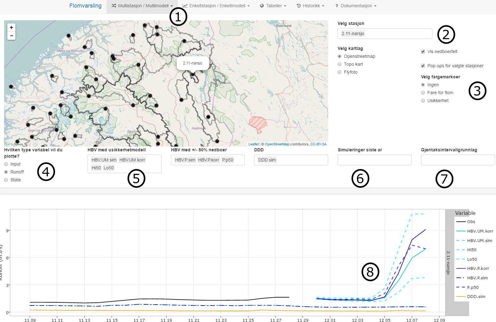
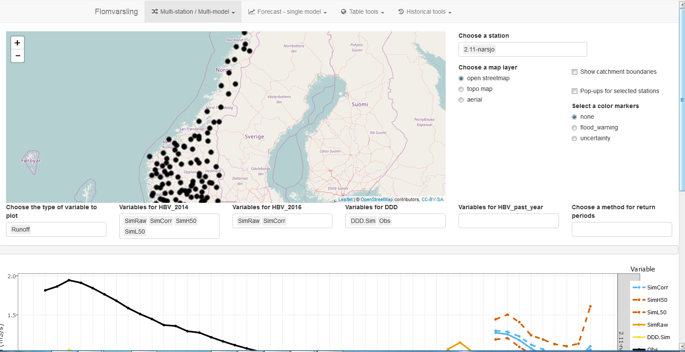
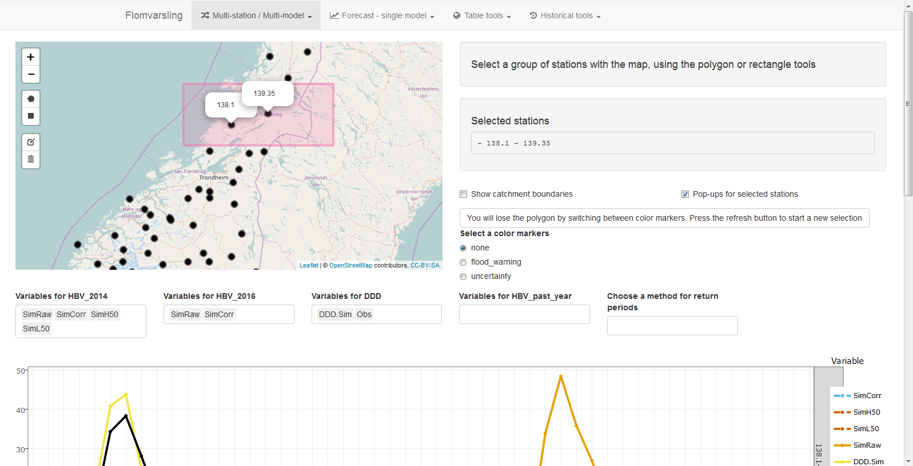

```{r setup, include=FALSE}
knitr::opts_chunk$set(echo = TRUE)
```


# What is it?

An R Shiny app to interactively visualize flood forecasting data and model results.

# Why was it developed?

A full-blown website is already used daily for the flood warning service: [xgeo](www.xgeo.no)
As it is open to the public and can slow down during periods of intense use. It also does not allow plotting multiple model results at once.

This R application was developed to complement xgeo and serve as a prototyping platform before new ideas are eventually implemented in xgeo.

# How to run it?

After installing the `shiny` R package, you can run this application from anywhere with the following commands:
`library(shiny)`
`runGitHub("NVE/Flood_forecasting", ref = "docsite_with_rmd")`
Note that the .RData files read by the app will probably be out-of-date. 
Our aim is to have them updated automatically every day.

# Which features are implemented? How to use it?

Below is an annotated screenshot of the first tab:



**1. Available tabs**

The selected tab presents a multi-model and multi-station visualization using a dropdown selector. If you click on *Multistasjon*, you also get the option to select a group of stations by drawing rectangles or polygons.

The next set of tabs presents single-model and single-station plots of all the available variables (model input, model state and runoff).

The model results and metadata on the available stations (br23_HBV = "Y" and br9_Flomvarsling = "Y") are then available in the next set of tabs.

Finally historical results such as calibration results, past performance and seasonal averages are available under *Historisk*.

The last set of tabs links back to specific pages of this website.

**2. Station selection**

The station selection on this tab is cumulative. You can select stations either by clicking in the dropdown menu, or directly on the map by clicking on the station markers. To delete selected stations, click on them in the dropdown selector and press *delete*.

The last station selected will always be highlighted by a pop-up on the map. You can also tick the *show pop-ups* button to show all selected stations. In this screenshot, the catchment boundaries are also selected. This is not the case by default and this selection causes the app to slow down significantly.

**3. Quantitative map markers**

- *Risk for flood*

If *M* is the maximum value of the corrected HBV_UM during the forecast period and *RL* is the observed mean annual flood at this station, then:

*Risk for flood* = *M* / *RL*   

- *Forecast uncertainty*

If *Diff* is the maximum difference between the Hi90 and Lo90 estimates of HBV_UM during the forecast period and **RL** is the observed mean annual flood at this station, then:

*Forecast uncertainty* = *Diff* / *RL*   

**4. Choice of variable type**

The variable are group in 3 types: *inputs* to the model (temperature, precipitation), *state* of the model (groundwater level, soil moisture, snow storage) and *runoff* which includes measured discharge and various type of model output (confidence intervals, ensemble results).

**5. Choice of model-specific variables**

Here you can choose, in a cumulative way, which model-specific variables you want to plot. Those selectors either change or become redundant when changing the *variable type* selector.

**6. Past year results**

Here you can plot 3 different types of HBV_UM results for last yeat:

*HBV.UM.sim* represents the uncorrected model results using forecast input data.

*HBV.UM.korr* represents the corrected model results using forecast input data.

*HBV.UM.korr.med.obsMet* represents the corrected model results using measured input data.

**7. Return levels**

You can select *observed* and *simulated* return levels for the mean annual flood, the 5 and 50-year return floods.

**8. Interactive plots**

The plots are interactive. Hover over the lines to read values of all variables at specific times.
Explore the interactivity options at the uppe right of the plot. There are many different ways to interact with it.


# How to modify it or develop it further?

Please refer to the package [documentation](http://NVE.github.io/Flood_forecasting/index.html) for the programming details of this app.

# Ideas for further development

1. Multi-model forecaster's dashboard.
**Tab 1a:**

Plots of model runs from -20 to +9 days. It is also possible to view the last year of forecast data. 

    - Selection of a multiple stations based on region number, main number, clicking on map
    - Map markers can represent a selectable variable (currently flood_warning and uncertainty. could be extended to temperature / precip...)
    - Interactive multi-model plot: available models are HBV and DDD for the moment. The plot can include flood levels: mean flood and 5 year return level.

**Tab 1b:**

Same plots but a polygon selection tool allows selecting multiple neighbouring stations.
 





 
2. Tab 2: Single model / Single station

In addition to *discharge*, the plot also shows *state* (soil moisture, snow height) and *input* (temperature, precipitation) data.

3. Tab 3: Modeller's dashboard

Analysis of model performance / properties during the calibration period.
  - time series graphs, available time period, zoom functionality, tick on/off which models:
  - discharge: observations and all models
  - temperature and precipitation
  - Summary of model performance. There is the tricky question of how long of a time-interval to use. All perf indicators should use the same interval. 1 year is probably a good choice
     - NSE
     - KGE
     - Taylor diagram
     - Hit/miss/false alarm/correct reject table. If the timelapse is 1 year, the return level threshold should be discussed, 1 year return period being the maximum we could use.

Further ideas:
Regional analysis of model runs
Ouputs one plot per station of the model runs
Should this include a map with polygon selection or should the group of stations only originate from tab 1?

Historical hindsight: pull out past interesting events for a specific station or group of stations

Not all the files have data for the same number of stations (120-145). Check how the station numbers are organized.
Those files don't include catchment properties, so we will have to agree on the data files for those properties.
The observed flow and precip/temperature are included in all of those files.
