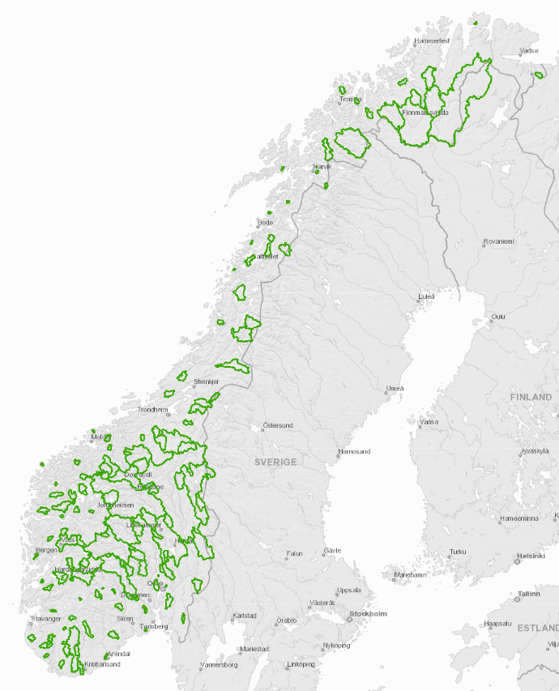

```{r setup, include=FALSE}
knitr::opts_chunk$set(echo = TRUE)
```


## Flood forecasting system

NVE is in charge of the national flood management system that includes a flood warning service. Hydrological catchment models have been used operationally for this purpose on a regular basis since 1989, and constitutes an essential part of the flood forecaster’s decision support tool. The models are integrated units in an operational system that makes updated meteorological data from the Meteorological Institute, i.e. observations and weather forecasts, available and, subsequently, carries out new model runs. Updated hydrological forecasts are, at present, made four times a day, see table 1. The system provides hydrological forecasts up to nine days in advance. 

*Table 1: Operational scheme for the hydrological models* 

The aim of the flood forecasting service is to gain time for preparedness measures before flood events strike. Model simulations and -forecasts have, however, a more widespread application. Weekly aggregates of daily climate, runoff and snow storage forecasts are used operationally to estimate energy inflow to reservoirs for hydropower production. Simulated energy inflow is, in turn, used to update the Samkjøringsmodellen (Power Market Simulator) for simulating the hydropower system. Moreover, once a week, an extended ensemble forecast is applied to the models, providing season scenarios for snow storage and –melt, sub-surface water content and runoff.

The catchment model system are made up by four different hydrological models, called HBV, DDD, ODM and DDMs, see the respective link for an explanation. The models have been developed on different platforms, and have entered the flood forecaster’s scene successively. This application serves as a common interface for presentation and comparison of the hydrological forecasts from the versatile ensemble of flood forecasting models. 

In addition to the catchment models, adapted distributed models operates on a 1 x 1 km2 grid covering Norway. Simulations and forecasts of gridded water balance components are shown in xgeo.no. These components are the basis for estimates of various hazard indexes, indicating increased risk of e.g. land- and slush slides.

### Input data

The models have a common base of input data. Input data to the models are precipitation and temperature, derived from interpolated grids, covering Norway with a spatial resolution of of 1 x 1 km2 and a temporal resolution of 24 hours, the seNorge grid (Lussana et al. 2016).These observation grids are available from 1957 up to present. The observation grids are made by spatial interpolation of all available point observations of precipitation and temperature, respectively. Similar forecast grids cover the period up to nine days ahead. For the forecast period, the grids are made by applying the precipitation and temperature grids from the operational NWP models and downscale to 1 x 1 km2. At present, forecasts from the mesoscale AROMEMetCoop model is used the first two days and forecasts from the medium-range ECMWF model is used for the rest of the period.

Some models operate on a temporal resolution of three hours. For this purpose, the daily seNorge-grid is disaggregated into eight three-hourly grids (ref).

### The model catchments

145 catchments spread over the country, representing most catchment scales and geographical regions of Norway and 33% of the land surface, are selected as model catchments for the flood forecasting service. This selection of catchments applies to all the hydrological models used in the flood forecadting system. Besides the requirement of representativeness, the 145 catchments are selected with an aim to use catchments with a long, high-quality and non-regulated data series, supply flood forecasts for the flood prone river reaches where flood zone maps are developed, and to have a good meteorological station coverage. Figure 1 shows a map where the 145 catchments are highlighted. The map includes two catchments, Numedalslågen at Kongsberg and Mjøsa at the outlet, where regression models have been developed on the basis of HBV catchment models within or close to the catchments.

*Figure 1: The flood forecasting model catchments* 

### References
Lussana, Cristian, Tveito, O. E. and Uboldi, F. 2016. seNorge v2.0, Temperature. An observational gridded dataset of temperature for Norway. METreport 14/2016

## Visualization tool

In complement of the website [www.xgeo.no](www.xgeo.no), an R shiny app was developed to allow vizualizing in a single graph the results of multiple models.

## Models

Hydrological catchment models are used to estimate the runoff level development the coming days, as a response to expected precipitation and temperature. The lead time considered is from one to nine days. The model forecasts constitutes a basic part of the flood forecaster’s decision support tool. When flood conditions are expected, a warning is published at NVEs avalanche, flood and landslide hazard warning portal, [Varsom](www.varsom.no).

#### [HBV](HBV.html)

HBV has been traditionally used at NVE for...

#### [DDD](DDD.html)

Blabla

#### [ODM](ODM.html)

Blabla

#### [DDM](DDM.html)

Blabla


## Data

Blabla

#### Meteo

Blabla

#### Flood return levels

Flood return levels are parsed by a specific function in the `NVEDATA`package. Please refer to its documentation for the default path and further details.
